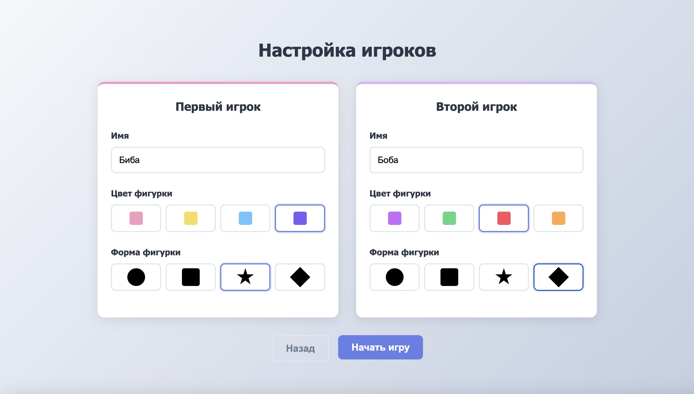
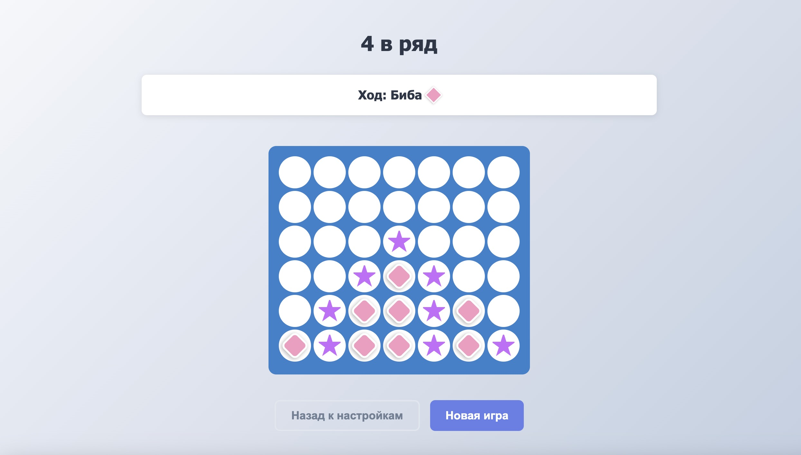
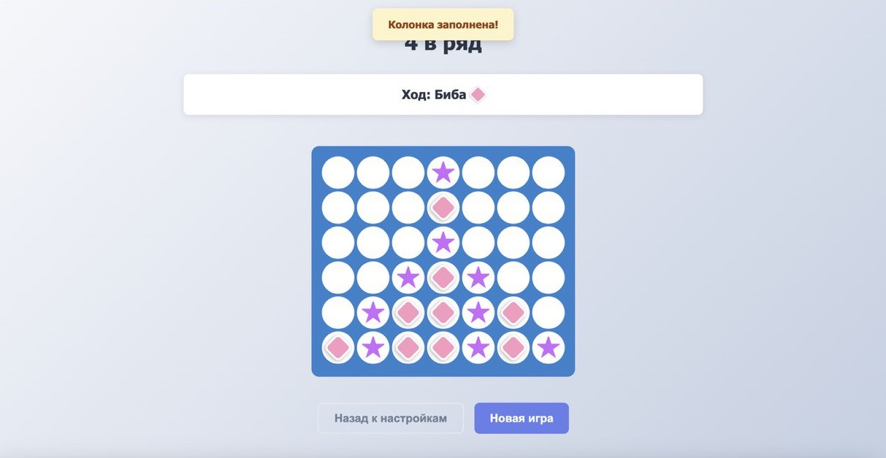
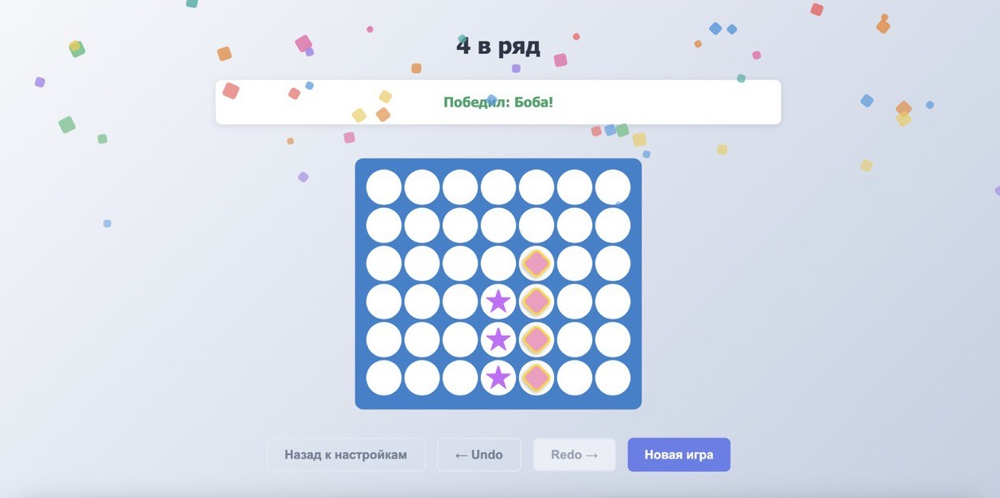

# <span style="font-size: 3rem; font-weight: 900; background: linear-gradient(90deg, #FFB6C1, #FF8EC7); -webkit-background-clip: text; -webkit-text-fill-color: transparent; text-shadow: 2px 2px 8px rgba(0,0,0,0.1); letter-spacing: 1px;">Игра «4 в ряд»</span>

Интеллектуальный поединок на поле 7×6

**Автор:** [Дмитриева Наталья](https://github.com/nnatttaly)

---

### ⚙️ Стек технологий


---

### 🍒 Как начать играть?

1. Клонировать репозиторий:
```sh
git clone https://github.com/nnatttaly/connect-four-game.git
```

2. Перейти в папку проекта:
```sh
cd connect-four-game
```

3. Установить зависимости:
```sh
npm install 
```

4. И запустить игру в режиме разработки:
```sh
npm run dev
```

Игра откроется по адресу: http://localhost:5173

---

### 🪄 Структура проекта

```text
📁 connect-four-game/
└── 📁 src/
    ├── 📁 components/      # Компоненты интерфейса игры
    ├── 📁 consts/          # Константы (например, размеры поля)
    ├── 📁 hooks/           # Кастомные React-хуки
    ├── 📁 pages/           # Основные страницы приложения
    ├── 📁 styles/          # Общие стили и темы
    ├── 📁 types/           # Типы данных и интерфейсы
    └── 📁 utils/           # Утилиты проекта
         └── 📄 validator.ts   # ✅ Функция validator (требование задания)
```

--- 

### 🕹️ Функциональность

#### 🌷 `/welcome`
Короткие правила и кнопка **«Играть»**  

 


#### 🧑‍🤝‍🧑 `/players`
Настройка игроков: ник, цвет и форма фишки  
Для каждого игрока своя палитра — цвета гармонируют между собой  

 


#### 🎲 `/game`
Основное поле **7×6**  
Отображается текущий игрок и его фигурка, есть возможность вернуться к настройкам или начать новую игру


 

#### 🎯 Особенности игрового процесса:

- Автоматическое определение победителя
- Подсветка победной комбинации
- При попытке поставить фишку в заполненную колонку появляется **предупреждение**



- При победе — **конфетти**! 🎉 🎉 🎉



---

### 💡 Сильные стороны проекта

- **React Router** — для приятного пользовательского опыта (SPA)

- **Кастомизация игроков** — уникальные настройки для каждого участника

- **Типизация** через as const и typeof array[number] 

- **Конфетти** чистый CSS для производительности (без canvas)

- **Оптимизированные хуки** — useRef, cleanup в useEffect 

- **Компонентный подход** — код разбит на файлы, компоненты переиспользуются

- **Адаптивный дизайн** — комфортно играть на любом устройстве 

---

### 💖 ПРИЯТНОЙ ИГРЫ! 💖
